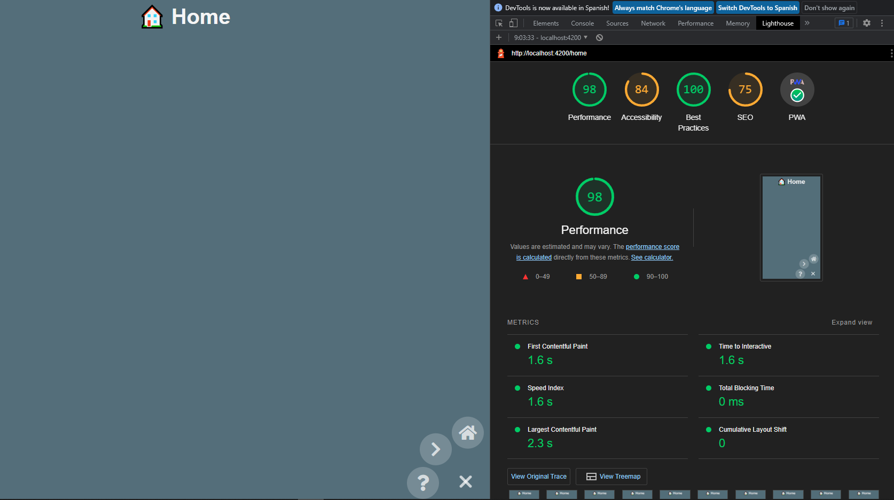

# UTILIZACIÓN
  
  Requisito previo Nodejs instalado: v16.17.0 o superior

  [enlace a descarga window](https://nodejs.org/es/download/)

  instalar normalmente

  ## descargar proyecto desde github

  [descarga proyecto](https://github.com/JUANLUNABLANCO/scafolding-pwa-spa/archive/refs/heads/main.zip)

  descomprimir con winrar o unzip

  [descarga winrar](https://www.winrar.es/descargas/52/descargar-winrar-para-windows-en-espanol)

  instalar normalmente y usara para descomprimir el proyecto

  ## Opción alternativa tener git instalado en window (usuario avanzado)

  [descarga git](https://github.com/git-for-windows/git/releases/download/v2.38.1.windows.1/Git-2.38.1-64-bit.exe)

  si usas esta opción ya sabes que hacer 

  > git clone https://github.com/JUANLUNABLANCO/scafolding-pwa-spa.git

  ## Una vez instalado todo lo necesario para poder ejecutar proyectos web en tu máquina

  accedes a la carpeta del proyecto ya descomprimida verás algo como esto

  [imagen de carpetas del proyecto](snapshoot-folder-project.png) 

  ## primero instalar dependencias
    
    desde la terminal y ubicado en la raíz del proyecto ejecutas el siguiente comando, sin '>':

    > npm install

  ## Testing

    Con esto podrás acceder alos tests de cypress y ver su ejecución en una interfaz de navegador

    > npm run cypress:node 
  
  ## servidor local

    Con esto ejecutas el proyecto en tu navegador de forma local

    > npm run node:dev

    [dirigete al navegador](http://localhost:8080)

  ## built project salida en ./dist

    Con esto lo construyes para poder servirlo en un servidor remoto, (usuarios avanzados)

    > npm run built
  

# ¿QUÉ HEMOS HECHO?: SPA, PWA, VANILLA JS
En este proyecto crearemos una  APP, de tipo Single Page Application + Progressive Web App, solo con vanilla js + HTML + CSS, sin frameworks de ningún tipo, ni REACT, ni ANGULAR, ni VUE, ni BOOSTRAP, ni TAILDWIND, demostrando que se puede hacer una aplicación de este tipo solo con el lenguaje, sin añadiduras, lo que tiene sus pros y sus contras:

  1. Menor peso de la aplicación y por tanto mejores cargas (aunque esto dependerá también de otros procesos)
  2. Es una aplicación que sigue los estandares del lenguaje HTML, CSS y JS, por tanto durable en el tiempo, ya que si se realiza con otros frameworks y/o librerías, dependemos de ellos/as para la actualización
  3. Más difícil de realizar en principio, pues REACT, ANGULAR, etc te dan muchas cosas ya generadas, construidas.

Utilizaremos algunas librerías para la facilitación de procesos: webpack
  4. webpack es un empaquetador, hace de intermediario entre nuestro proyecto puro y el proyecto para producción, realizando y automatizando algunas tareas, como comprimir el código, minificarlo, enrarizarlo, y otras cosas.
  También nos proporciona un servidor de desarrollo, que hubiésemos tenido que montar con nodejs u otros.

Contendrá los siguientes módulos básicos:
  
  1. Routing 
  2. pages
  3. components

La estructura de carpetas será lo más conveniente para satisfacer una Clean Arqchitecture
# PROCEDIMIENTOS E INSTALACIONES
  Requisito previo Nodejs instalado: v16.17.0 

  creamos este archivo
  > touch README.md

  empezamos un proyecto de Node.js
  > npm init

  instalaciones de webpack

  webpack | servidor de webpack | cli de webpack
  > npm install -D webpack              // empaquetador universal
  > npm install -D webpack-dev-server   // servidor de desarrollo ./src que escucha cambios
  > npm install -D webpack-cli          // ayuda con plugins al webpack

  cargador de archivos .html
  > npm install -D html-loader          // import html from "./file.html";
  > npm install -D html-webpack-plugin  // genera el HTML5 con el enlace al bundle.js. Esto genera una etiqueta en el html que enlaza con el bundle.js  siempr en ./dist

  cargador de archivos .css
  > npm install -D css-loader               // Translates CSS into CommonJS. import css from "file.css"; in component.js
  > npm install -D mini-css-extract-plugin  // import "./style.css"; in component.js

  
  extractor de archivos sass
  > npm install -D node-sass      // tener sass en el proyecto
  > npm install -D sass-loader    // Compiles Sass to CSS
  > npm install -D style-loader   // Creates `style` nodes from JS strings tanto desde css como desde sass

  archivos de imagenes
  > npm install -D file-loader    // carga imagenes en archivos html y js además de las urls de css

  cypress testing
  > npm install -D cypress        // cypress framework

  ## CONFIGURACIONES WEBPACK
  // configuracion webpack.config.js 
  const MiniCssExtractPlugin = require("mini-css-extract-plugin");
  module.exports = {
    plugins: [new MiniCssExtractPlugin()],
    module: {
      rules: [
          // html-loader zero-config
        { // html-loader
          test: /\.html$/i,
          loader: "html-loader",
        },
        { // mini-css-extract-plugin
          test: /\.css$/i,
          use: [MiniCssExtractPlugin.loader, "css-loader"],
        },
        { // css-loader
          {
            test: /\.css$/i,
            use: ["style-loader", "css-loader"],
        },
        {
          test: /\.css$/i,
          use: [MiniCssExtractPlugin.loader, "css-loader"],
        },
        { // tres en uno sass-loader // si instalas este elimina los otros tres de arriba
          test: /\.s[ac]ss$/i,
          use: [
            // Creates `style` nodes from JS strings
            "style-loader",
            // Translates CSS into CommonJS
            "css-loader",
            // Compiles Sass to CSS
            "sass-loader",
          ],
        },
        { // file-loader ??? con html-loader deberia bastar
          test: /\.(png|jpe?g|gif)$/i,
          use: [
            {
              loader: 'file-loader',
            },
          ],
        },

      ],
    },
  };

   --- VER EL ARCHIVO DE CONFIGURACIÓN PARA DEV Y PROD

# ARCHIVOS DE CONFIGURACION PRODUCTION DEVELOPMENT AFINANDO
  ## WEBPACK
  --- webpack.config.js ---
  module.exports = ({ env }) => require(`./webpack.config.${env}.js`);

  --- webpack.config.dev.js ---
  ver archivo en la carpeta ./webpack

  --- webpack.config.prod.js ---
  ver archivo en la carpeta ./webpack

  > mkdir webpack
  > touch ./webpack/webpack.config.js
  > touch ./webpack/webpack.config.dev.js
  > touch ./webpack/webpack.config.prod.js
    ... VER ARCHIVOS

# SCRIPTS NPM
  // testing
  "cypress:open": "cypress open",

  // serve in dev, ./src files
  "node:dev": "webpack serve --config ./webpack/webpack.config.js --env env=dev --open",
  
  // built in prod, ./dist files
  "clean": "rimraf dist",
  "built": "npm run clean && webpack --config ./webpack/webpack.config.js --env env=prod",
  "built": "npm run clean && webpack -d --config ./webpack/webpack.config.js --env env=prod", // con -d lo hace legible

# ARCHIVOS INICIALES

> touch index.html
> touch main.css
> touch main.js

  ./src
    |____ assets / images, svg, icons
    |____ index.html
    |____ main.js
    |____ main.css  

# ARCHIVOS GENERADOS PARA PRODUCCION

  ./dist
   |___ index.html
   |___ bundle.js   
   |___ main.css

# ENLAZAR LOS ARCHIVOS DE LA MANERA TRADICIONAL
  El CSS
    <code><link rel="stylesheet" href="main.css">
  </head></></code>
  
  El js
    <code>
  </body></code>
  
  con webpack esto no es necesario, tira de configuración

# ESTRUCTURA DE DIRECTORIOS DEV

  Clean Architecture
  ./src
    |____ assets
    |____ domain
    |     |____ services
    |____ infraestructure
    |     |____ components
    |     |     |____ AComponent
    |     |           |____ AComponent.html
    |     |           |____ AComponent.css
    |     |           |____ AComponent.js
    |     |            
    |     |____ localStorage
    |     |____ pages
    |     |____ router
    |____ index.html
    |____ main.js
    |____ main.css

  # SASS ???
    crea la carpeta sass dentro de ./src y crea un archivo main.scss
  ## ventajas de usar sass
    Reduce el tiempo para crear y mantener el CSS. Permite tener una organización modular de los estilos, lo cual es vital para proyectos grandes. Proporciona estructuras avanzadas propias de los lenguajes de programación, como variables, listas, funciones y estructuras de control. Permite generar distintos tipos de salida, comprimida, normal o minimizada, trabajando tanto en desarrollo como en producción, además se hace una forma muy fácil. Permite vigilar los ficheros, de tal manera que, si ha habido un cambio en la hoja de estilos, se regenera automáticamente (modo watch).
    Tiene muy pocas dependencias, sobre todo la nueva versión, que es dart-sass. En las anteriores versiones se dependía de muchas librerías de Ruby y era un poco engorroso de instalar, pero con la nueva versión, la instalación es muy fácil.

  ## para este proyecto no va a ser necesario
  Existen muchas herramientas asociadas, muchas librerías hechas con Sass y una comunidad muy importante de usuarios.

  Al final NO vamos a utilizar sass, nuestro html no necesita tener enlaces al css ni al js, de eso se encarga webpack
  por eso la configuración, pruebalo:
  Sirve una pagina web a partir de los archivos de src, enlazándolos

  > npm run node:dev

  destruye el ./dist y lo vuelve a construir con las compilaciones necesarias (sass to css) y las cargas de archivos desde ./src
  También hace otras cosas como minificar archivos css y js. 
  En este caso no sirve nada, solo hace el build de la aplicación, eso irá a prdoucción, por tanto la carpeta que se debe llevar desde github a netlify es ./dist
  Por tanto ./ se necesita llevar a producción, ya sea haciendo el > npm run build:prod y luego el git push
  O automatizando en el repo de git para que haga el built y se genere la carpete dist automáticamente tras el test
  
  > npm run built

  para importar el css dentro del js usa esto, junto con el css-loader

  --- main.js ---
  import './src/main.css';

  para importar html en el js usa esto otro, junto con el html loader

  --- main.js --- 
  import './component/template.html';

# webpack dev server
> npx webpack-dev-server // si webpack.config.js está en la raíz

> npm run node:dev // con la configuración nueva

# web components
ver el ejemplo en ./components/prueba.js

# GIT PRIMER COMMIT ESCAFOLDING
> git init
> touch .gitignore
> echo "# Generic Node" >> .gitignore
> echo "node_modules" >> .gitignore

tendremos las siguientes ramas
  main (rama principal en producción)
  develop (rama de soluciones locales, contendrá la ultima versión main + features + tests ok)
  feature/ (muchas ramas 1 por cada feature)

  > git init
  > git config --local user.email "desarrolloaplicacionesweb.jmlb@gmail.com"
  > git config --local user.name "JUANLUNABLANCO"
  > git add .
  > git commit -m "scafolding with routing. first commit"
  > git branch -M main
  > git remote add origin https://github.com/JUANLUNABLANCO/scafolding-pwa-spa.git
  > git push -u origin main

  
# PRIMERAS PRUEBAS DE ROUTING
seguiremos TDD, creando primero los tests,que fallarán, luego implementaremos el código, hasta que pase los tests y después refactorizaremos, subiendo el resultado a la feature/correspondiente
usaremos cypress, por su potencia, sencillez y su interfaz gráfica.

solicitando un pull request a develop, en la cual se deberían realizar otros tests de integración o e2e

y por último en main se deben pasar los tests atacando la app en producción, esto no lo implementaremos de momento,

Todo esto podría ser automatizado con CI/CD pipelines, ...AZURE DEVOPS, o cualquier otro, de momento lo estamos realizando a mano.

se debería probar: 
  1. PRUEBAS SOBRE PAGES Y COMPONENTS 
  2. PRUEBAS DE STORAGE
  3. PRUEBAS DE PWA
  4. PRUEBAS DE INTEGRACION 
  
## testing with cypress
> npm run node:dev
> npm run cypress:open

## check that the app is PWA, cumpliments of Lighthouse cheker extension tool

you can visit https://github.com/GoogleChrome/lighthouse/blob/HEAD/docs/user-flows.md
install the extension in the browser called: lighthouse
going to tools for developers in browser (the app must be served in localhost or remote server)
and click in the button Analyze page load (first you can check diferents configurations like, navigation, device, ...)
wait for a seconds and you obtain a visual score table, with diferents skills of the app.

performance, Accesibility, Best Practices, SEO, and PWA acceptance.

 
